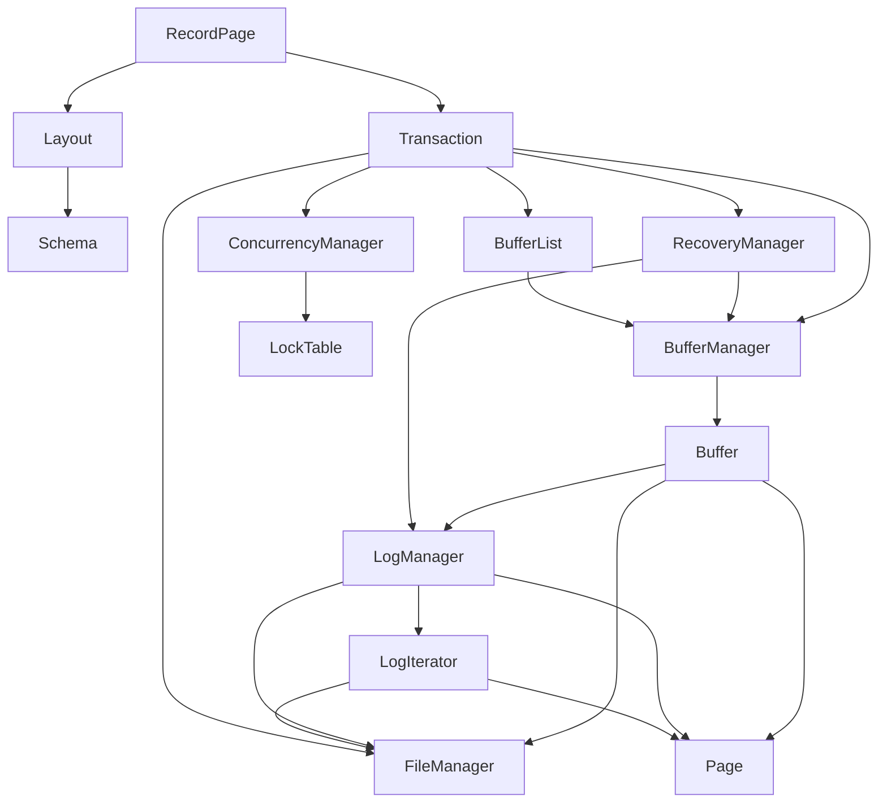

# Overview



## Block
- データを保存する単位
  - 固定長
- ブロック内にバイト列を保存する

## Page
- ファイルに書き出す前にメモリでデータを一時的に保持する
  - キャッシュ的なイメージ
  - データを読み書きするたびにファイルI/Oが発生するのはパフォーマンスが悪い
  - なので、データを一時的に速いメモリに保存して、適切なタイミングにファイルに書き出す
- ブロックのサイズのバッファを持つ
  - つまりblock:pageは1:1と考えて良さそう

## File Manager
- データを保存するファイルを管理する
- ファイルに保存されている特定ブロックをPageに読み込む
- Pageをファイルに書き出す
- ファイルに新しいブロックの領域を作成
  - ファイルがなければ新規作成され、ブロック領域が初期化される

## Log Manager
- File Manager と Page、Blockを使ってログレコードの管理をする
- このログはロールバックなどで使われる

```
                        block
┏━━━━━━━━━━━━━━━━━━━━━━━━━┻━━━━━━━━━━━━━━━━━━━━━━━━━━━━━┓
┌───┬───┬───┬───┬───┬───┬───┬───┬───┬───┬───┬───┬───┬───┐
│ 0 │ 0 │ 0 │14 │ 0 │ 0 │ 0 │ 6 │ h │ e │ l │ l │ o │ , │
└───┴───┴───┴───┴───┴───┴───┴───┴───┴───┴───┴───┴───┴───┘
┗━━━━━━━┳━━━━━━━┻━━━━━━━┳━━━━━━━┻━━━━━━━━━━━┳━━━━━━━━━━━┛
 record boundary    record size        record data
                ┗━━━━━━━━━━━━━━━━━━━┳━━━━━━━━━━━━━━━━━━━┛
                                 record
```

`LogManager::new()`の挙動について

1. pageを作成
2. ファイルのブロック数を取得
  1. ファイルを取得
    1. ファイルがなければ新規作成
    2. ファイルがあればそレを使う
  2. ファイルのサイズ/ブロックのサイズでブロック数を取得
    - ファイルを作成した時点でサイズは0なので、ブロック数は0になる
  3. ブロック数が0の場合は新規ファイルなので、ブロックの領域をファイルに書き込む(append_block)
    1. ブロックの番号 * ブロックサイズでoffset算出
    2. ブロックのサイズのバイト列を用意して、ファイルのoffsetから書き込む
  4. ブロック数が1以上の場合は、最後のブロックを使用中のブロックとして中身をPageに読み出す

つまり、`LogManager::new()`した時点で以下の状態になる

- ファイルに1つ以上のブロックが存在する
- 最後のブロックの中身がPageに読み出されている

`LogManager::append()`の挙動について

1. pageのoffset0にあるブロック長を取得
2. レコードサイズの値を取得
3. レコードサイズ+レコードデータのバイト長を取得
4. レコードデータがブロックサイズを超えている場合（ブロック長 - レコード全体の長さ < 4 の 4 はページの最初の4バイト = ブロック長なので、それを省いた領域がブロックに入るデータ量）
  1. ページをファイルに書き出す
  2. 最後に書き出したレコードidを更新
  3. 新しいブロック領域を追加
    1. 新しいブロックをファイルに追加
    2. ページのoffset 0にブロックサイズを書き込む
    3. ファイルにページデータを書き出す
      - ページを書き出したあと、なぜ新しいブロック領域に同じページを書き出す？
      - この場合のページデータはどうなっている？
    4. 新しいブロック長を取得
  4. レコード書き込む先のoffsetを取得
  5. pageのoffsetにレコードを書き込む
  6. ページの先頭にレコードのoffsetを書き込む
  7. lsnを採番

## Buffer Manager
- 実際にデータベースを管理する
- ファイルの読み書き
- データ読み書き時はページが固定され、それが終わると固定が解除される

## Schema
- テーブルレコードのスキーマ情報を持つ
- フィールド名や型、データ型の長さの情報を持つ

## Layout
- テーブルレコードのレイアウト
- Schemaと各フィールドのオフセットの情報を持つ

## RecordPage
- スロットの集まり
- スロットはレコードの種類とレコードのデータを保持

```
                                             file
┏━━━━━━━━━━━━━━━━━━━━━━━━━━━━━━━━━━━━━━━━━━━━━┻━━━━━━━━━━━━━━━━━━━━━━━━━━━━━━━━━━━━━━━━━━━━━━━━━━━━━┓
                                  block                                             other bloks   
┏━━━━━━━━━━━━━━━━━━━━━━━━━━━━━━━━━━━┻━━━━━━━━━━━━━━━━━━━━━━━━━━━━━━━━━━━━━━━┳━━━━━━━━━━━┻━━━━━━━━━━━┓
                       slot                                 other slots
┏━━━━━━━━━━━━━━━━━━━━━━━━┻━━━━━━━━━━━━━━━━━━━━━━━━━━┳━━━━━━━━━━━┻━━━━━━━━━━━┓
                               record
                ┏━━━━━━━━━━━━━━━━━┻━━━━━━━━━━━━━━━━━┓
┌───┬───┬───┬───┬───┬───┬───┬───┬───┬───┬───┬───┬───┬───┬───┬───┬───┬───┬───┬───┬───┬───┬───┬───┬───┐
│ 1 │ 0 │ 0 │ 0 │ 6 │ 0 │ 0 │ 0 │ h │ e │ l │ l │ o │...│...│...│...│...│...│...│...│...│...│...│...│
└───┴───┴───┴───┴───┴───┴───┴───┴───┴───┴───┴───┴───┴───┴───┴───┴───┴───┴───┴───┴───┴───┴───┴───┴───┘
┗━━━━━━━┳━━━━━━━┻━━━━━━━┳━━━━━━━┻━━━━━━━━━┳━━━━━━━━━┛
   record type       integer         varchar(5)
(0: emtpy, 1: used)
```
